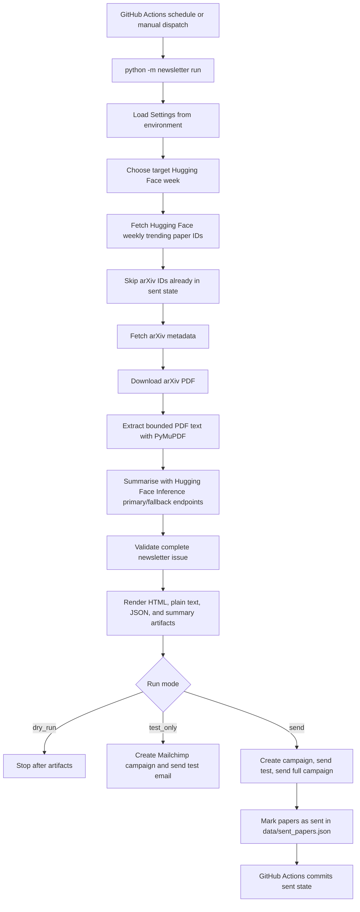

# Architecture

## Purpose

AI Research Weekly is a scheduled Python workflow that turns the latest Hugging Face Trending Papers into a short email newsletter. The system discovers candidate papers, grounds each summary in the paper's arXiv PDF, renders email-ready HTML and plain text, and optionally sends the issue through Mailchimp.

The design goal is a reliable v1 publishing pipeline with low operational overhead: no long-running server, no database, no custom subscriber management, and clear review points before anything reaches subscribers.

## High-level Flow

## Runtime Model

The workflow is implemented as a Python CLI rather than a web application. The main entry point is `python -m newsletter run`, defined in `src/newsletter/__main__.py`. It loads `.env` locally, reads runtime configuration through `Settings`, and delegates the actual orchestration to `NewsletterWorkflow`.

GitHub Actions runs `.github/workflows/weekly-newsletter.yml` every Sunday at `12:05 UTC`. Manual dispatch supports three modes:

- `dry_run`: build artifacts only.
- `test_only`: create a Mailchimp campaign and send a test email to `ADMIN_EMAIL`.
- `send`: send to the live audience and update sent-paper state.

Scheduled runs default to `send`. Every GitHub Actions run installs the package, runs `pytest`, builds the issue, uploads `outputs/` as an artifact, and appends `outputs/latest_summary.md` to the workflow summary. Sent state is committed only after a successful `send` run.

## Core Components

| Component | File | Responsibility |
| --- | --- | --- |
| CLI | `src/newsletter/__main__.py` | Parses run mode, week, count, state path, and output directory. |
| Settings | `src/newsletter/config.py` | Reads environment variables, applies defaults, and enforces required LLM/send configuration. |
| Workflow orchestration | `src/newsletter/workflow.py` | Coordinates discovery, deduplication, enrichment, summarisation, validation, rendering, delivery, and state updates. |
| Hugging Face discovery | `src/newsletter/hf_papers.py` | Reads the weekly trending page and extracts ordered arXiv IDs. |
| arXiv/PDF handling | `src/newsletter/arxiv.py` | Fetches metadata, downloads PDFs, extracts and cleans bounded PDF text. |
| Author formatting | `src/newsletter/authors.py` | Abbreviates long author lists for prompts and rendered outputs. |
| Summarisation | `src/newsletter/llm.py` | Calls Hugging Face Inference primary/fallback endpoints and parses the model response into a structured summary. |
| Validation | `src/newsletter/evals.py` | Fails the issue before delivery if required metadata or summary fields are missing. |
| Rendering | `src/newsletter/render.py` | Produces email HTML and plain text. |
| State | `src/newsletter/state.py` | Stores sent arXiv IDs and Mailchimp campaign IDs in `data/sent_papers.json`. |
| Email provider boundary | `src/newsletter/providers/base.py` | Defines the delivery interface used by the workflow. |
| Mailchimp provider | `src/newsletter/providers/mailchimp.py` | Creates campaigns, sets content, sends tests, and sends full campaigns. |

## Data Flow

The workflow moves data through a small set of explicit dataclasses in `src/newsletter/models.py`:

1. `PaperCandidate`: arXiv ID and Hugging Face URL from the trending page.
2. `PaperMetadata`: title, authors, arXiv links, PDF URL, and Hugging Face URL.
3. `PaperSummary`: five fixed fields generated from the extracted PDF text.
4. `NewsletterPaper`: metadata, summary, and source week.
5. `NewsletterIssue`: generated timestamp, week, and selected papers.

Those models keep the pipeline easy to reason about. Each stage enriches the previous stage rather than passing around unstructured dictionaries.

## Selection and Deduplication

The system uses Hugging Face weekly trending pages as the discovery source because they provide an already-ranked shortlist of active AI papers. The workflow walks that list in order and skips any arXiv ID already present in `data/sent_papers.json`.

Only arXiv IDs are used for duplicate prevention. This is intentional: titles can change, Hugging Face URLs are secondary, and arXiv IDs are stable enough for the state file to remain small and human-editable.

## Grounded Summarisation

Summaries are generated from extracted arXiv PDF text only. The prompt explicitly tells the model not to use outside knowledge and asks for exactly five JSON fields:

- `executive_summary`
- `problem`
- `method`
- `why_it_matters`
- `limitations`

This gives the newsletter a predictable structure and makes validation possible before delivery. PDF input is bounded by `PDF_TEXT_MAX_CHARS` to control cost, latency, and model context size. Long author lists are abbreviated in the prompt as `First Author et al.` to avoid spending context on metadata. The workflow also rejects papers when extracted text is shorter than `MIN_PDF_TEXT_CHARS`, which catches broken downloads, image-only PDFs, or extraction failures before they become weak summaries.

## Delivery Modes

The run modes are deliberately separate because newsletter publishing has different risk levels:

- `dry_run` is for local development and scheduled/manual review. It writes artifacts but does not touch Mailchimp.
- `test_only` exercises the Mailchimp campaign path and sends only to `ADMIN_EMAIL`. It does not update `data/sent_papers.json` because subscribers have not received the issue.
- `send` creates the campaign, sets content, sends a test email, sends the full campaign, and only then records the papers as sent.

The state update happens after the full Mailchimp send succeeds. That ordering avoids marking a paper as sent when no subscriber email went out.

## Outputs and Persistence

Generated outputs are written to `outputs/`:

- `{week}.html`
- `{week}.txt`
- `{week}.json`
- `latest_summary.md`

These are uploaded as GitHub Actions artifacts and are not intended to be committed. The durable application state is only `data/sent_papers.json`, which stores arXiv ID, title, authors, source week, sent timestamp, and Mailchimp campaign ID.

This keeps the repository clean while preserving the single piece of state required for idempotency.

## Failure Handling

External calls are retried with exponential backoff:

- Hugging Face weekly page fetch: 3 attempts.
- arXiv metadata fetch: 3 attempts.
- PDF download: 2 attempts.
- LLM summarisation: 3 attempts for transient failures on each configured model endpoint.

The default LLM path uses `google/gemma-3-27b-it`, then falls back to `CohereLabs/aya-expanse-32b` if the primary endpoint fails or returns unusable JSON. Both endpoints use Hugging Face provider routing with `provider="auto"` unless a provider override is supplied.

Failures for a single paper are recorded in the skipped list and the workflow continues to the next trending paper. The issue fails validation if no usable papers remain or if a selected paper is missing required fields. That means a bad candidate should not stop the whole issue, but an empty or incomplete newsletter should not be sent.

## Key Design Considerations

The system was designed around a few practical constraints:

- **Low operational burden:** A scheduled CLI in GitHub Actions is enough for a weekly batch job. There is no server to host, monitor, or scale.
- **Review before delivery:** Dry-run artifacts, workflow summaries, and `test_only` mode make it possible to inspect generated content before sending to subscribers.
- **Grounded content:** arXiv PDFs are the source of truth for summaries. This reduces hallucination risk compared with summarising from titles, abstracts, or external knowledge.
- **Small, auditable state:** A JSON state file is sufficient for duplicate prevention and can be manually repaired if a recovery step is ever needed.
- **Failure isolation:** One broken PDF, primary LLM endpoint failure, or model response should not prevent the system from trying the fallback endpoint or the rest of the trending list.
- **Provider flexibility:** Email delivery is behind an `EmailProvider` protocol, so Mailchimp-specific API details do not leak into the workflow.
- **Security and compliance:** Secrets come from environment variables or GitHub Secrets. Mailchimp handles signup forms, subscriber storage, unsubscribe links, double opt-in, and list hygiene.
- **Cost and latency control:** The workflow limits selected paper count and PDF text length. This keeps LLM calls bounded and predictable.
- **Testable boundaries:** Tests cover parsing, configuration defaults, rendering, validation, state writes, output summaries, and the differences between test-only and live-send behavior.

## Known Tradeoffs

This v1 architecture optimizes for simplicity, not maximum automation.

- Hugging Face discovery depends on the structure of the public weekly papers page.
- PDF extraction with PyMuPDF is practical and fast, but it can miss information in figures, tables, equations, or scanned PDFs.
- The workflow has no custom editorial approval UI; review happens through artifacts, workflow summaries, and Mailchimp test emails.
- `data/sent_papers.json` is simple to audit, but concurrent live sends should be avoided because they would contend on the same state file.
- If Mailchimp sends successfully but the later GitHub commit of sent state fails, the next run may try to send the same papers again. Recovery is manual: add the sent arXiv IDs and campaign ID to `data/sent_papers.json` and commit before the next scheduled run.

## Extension Points

The current boundaries leave room for later changes without rewriting the whole workflow:

- Add another discovery source before or beside Hugging Face Trending Papers.
- Add a different `EmailProvider` implementation for another ESP.
- Add editorial approval by saving a draft issue and requiring a later `send` step.
- Store richer issue history in a database or object store if artifacts and Mailchimp campaign history become insufficient.
- Add more validation checks, such as summary length limits, citation checks, or model-output quality scoring.
